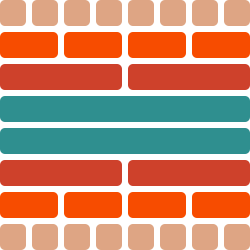

<div align="center">

# Layout

**Struct-of-Arrays** and **data-oriented design** in Rust


<br><br>

[](https://crates.io/crates/layout)
[](https://github.com/fereidani/layout)
[](https://github.com/fereidani/layout/actions)
[](https://docs.rs/layout)

</div>

## Introduction

Layout turns a plain struct into a struct of arrays with one derive. Instead of
storing whole structs back to back in a `Vec<T>`, it stores each field in its own
contiguous array, so a pass over one field loads only that field's memory.

This crate is a hard fork of [soa-derive](https://github.com/lumol-org/soa-derive)
with `no_std` support and extra features like impl block and compact bool and enums.

Add `#[derive(SOA)]` to a struct:

```rust
#[derive(SOA)]
pub struct Cheese {
    pub smell: f64,
    pub color: (f64, f64, f64),
    pub with_mushrooms: bool,
    pub name: String,
}
```

The derive generates `CheeseVec`:

```rust
pub struct CheeseVec {
    pub smell: Vec<f64>,
    pub color: Vec<(f64, f64, f64)>,
    pub with_mushrooms: Vec<bool>,
    pub name: Vec<String>,
}
```

`CheeseVec` has the same API as `Vec<Cheese>`, plus helper types that mirror how
you borrow a `Cheese`:

| Helper           | Stands in for   |
| ---------------- | --------------- |
| `CheeseSlice`    | `&[Cheese]`     |
| `CheeseSliceMut` | `&mut [Cheese]` |
| `CheeseRef`      | `&Cheese`       |
| `CheeseRefMut`   | `&mut Cheese`   |

Every derived struct implements the `SOA` trait. Use `<Cheese as SOA>::Type` when
you need the generated type generically instead of naming `CheeseVec`.

### Auto-generated methods on refs (`#[soa_impl]`)

A method written on `Cheese` will not run on `CheeseRef` unless you write it
twice. `#[soa_impl]` copies an `impl` block onto the generated reference types
for you.

```rust
use layout::{soa_impl, SOA};

#[derive(SOA)]
pub struct Particle {
    pub name: String,
    pub mass: f64,
}

#[soa_impl]
impl Particle {
    // &self methods land on ParticleRef<'a>
    pub fn kinetic_energy(&self, velocity: f64) -> f64 {
        0.5 * self.mass * velocity * velocity
    }

    // &mut self methods land on ParticleRefMut<'a>
    pub fn scale_mass(&mut self, factor: f64) {
        self.mass *= factor;
    }

    // associated functions and Self-returning methods stay on Particle only
    pub fn new(name: String, mass: f64) -> Self {
        Particle { name, mass }
    }
}
```

`ParticleRef` holds references (`&T` rather than `T`), so the macro inserts
dereferences where a method reads or writes a field by value:

| Source                | Generated                      |
| --------------------- | ------------------------------ |
| `self.mass * 2.0`     | `(*self.mass) * 2.0`           |
| `self.mass *= factor` | `*self.mass *= factor`         |
| `self.mass = val`     | `*self.mass = val`             |
| `self.name.len()`     | `self.name.len()` (auto-deref) |
| `-self.x`             | `-(*self.x)`                   |
| `self.x as i32`       | `(*self.x) as i32`             |

### Compact columns (`Compact<T>`)

A `bool` column costs a byte per row. A small enum costs four or eight.
`Compact<T>` shrinks narrow columns to the minimum width: `bool` and one-bit
enums take one bit, larger fieldless enums take 2 or 4.

```rust
use layout::{Compact, CompactRepr, SOA};

#[repr(u8)]
#[derive(Clone, Copy, CompactRepr)]
enum Kind { Player, Enemy, Projectile, Pickup } // 4 variants -> 2 bits

#[derive(SOA)]
struct Entity {
    id: u32,
    active: Compact<bool>,   // 1 bit per entity
    kind: Compact<Kind>,     // 2 bits per entity
}
```

A fieldless enum opts in with `#[derive(CompactRepr)]` and an unsigned
`#[repr(uN)]`. The derive rejects enums whose variants carry data, and it sizes
storage from the largest discriminant, so `{ A = 1, B = 255 }` uses eight bits.

> **Keep the import names.** `#[derive(SOA)]` recognizes a compact column by
> matching the path-segment name `Compact` / `CompactBool` (a proc-macro
> limitation: derive macros see tokens, not resolved types). A renamed or
> re-exported import — `use layout::Compact as Packed;` with a field
> `Packed<bool>` — is **not** recognized and silently falls back to a plain
> `Vec<Packed<bool>>` (full byte per element, no error, no warning). Use the
> names `Compact` / `CompactBool` directly, or a fully-qualified path
> (`::layout::Compact<bool>`) — both keep the last segment as `Compact`.

Read and write through `get` and `set`:

```rust
let mut entities = EntityVec::new();
entities.push(Entity { id: 0, active: Compact(true), kind: Compact(Kind::Player) });

if entities.get(0).unwrap().active.get() {
    entities.get_mut(0).unwrap().kind.set(Kind::Enemy);
}

// count a value across the whole column
let active = entities.active.count(true);
let enemies = entities.kind.count(Kind::Enemy);
```

`count` encodes the value once and scans the packed words. For one-bit types it
lowers to `count_ones` / `count_zeros`, which LLVM turns into `POPCNT`. Counting
the active flag over 100k entities takes ~1.6 µs versus ~4.9 µs for
`Vec<bool>::iter().filter().count()`, and the column drops from ~97 KiB to
~12 KiB.

Reach for `Compact<T>` when many rows carry a narrow flag or tag: entity active
bits, tile or voxel types, collision layers, visibility masks. A packed column
that fits in L1 lets a later pass run faster. The cost shows up in a tight loop
that reads or writes the bit every iteration alongside other fields, because
extracting one bit costs more than loading one byte. If a flag sits on your hot
path, measure it with `cargo bench --bench game`.

## Usage

Add `#[derive(SOA)]` to each struct you want to convert. Pass extra traits for
the generated types through `#[layout(...)]`:

```rust
#[derive(Debug, PartialEq, SOA)]
#[layout(Debug, PartialEq)]
pub struct Cheese {
    pub smell: f64,
    pub color: (f64, f64, f64),
    pub with_mushrooms: bool,
    pub name: String,
}
```

To attach an attribute to a single generated type (say
`#[cfg_attr(test, derive(PartialEq))]` on `CheeseVec`), use `#[soa_attr]`:

```rust
#[derive(Debug, PartialEq, SOA)]
#[soa_attr(Vec, cfg_attr(test, derive(PartialEq)))]
pub struct Cheese {
    pub smell: f64,
    pub color: (f64, f64, f64),
    pub with_mushrooms: bool,
    pub name: String,
}
```

### Serialization (`serde`)

Enable the `serde` cargo feature and pass `Serialize, Deserialize` through
`#[layout(...)]` to (de)serialize the generated `Vec` as a struct of arrays.
Compact columns (`Compact<T>`, `CompactVec<T>`) round-trip as their decoded
values; the feature works with `no_std` + `alloc`.

```toml
[dependencies]
layout = { version = "0.2", features = ["serde"] }
serde  = { version = "1", features = ["derive"] }
```

```rust
#[derive(Clone, PartialEq, serde::Serialize, serde::Deserialize, SOA)]
#[layout(Clone, PartialEq, Serialize, Deserialize)]
pub struct Entity {
    pub id: u32,
    pub active: Compact<bool>, // serializes as a bool array
}
// EntityVec serializes to: {"id":[1,2],"active":[true,false]}
```

The first argument picks the target type:

| Token      | Generated type   |
| ---------- | ---------------- |
| `Vec`      | `CheeseVec`      |
| `Slice`    | `CheeseSlice`    |
| `SliceMut` | `CheeseSliceMut` |
| `Ref`      | `CheeseRef`      |
| `RefMut`   | `CheeseRefMut`   |
| `Ptr`      | `CheesePtr`      |
| `PtrMut`   | `CheesePtrMut`   |

## API and caveats

The generated code carries its own documentation, so `cargo doc` renders every
struct and function. In most cases you can swap `Vec<Cheese>` for `CheeseVec`.
The exceptions come from how `Vec` leans on references and `Deref`.

`CheeseVec` cannot implement `Deref<Target = CheeseSlice>`, because `Deref` must
return a reference and `CheeseSlice` is not one. The same holds for `Index` and
`IndexMut`, which would have to return `CheeseRef` / `CheeseRefMut`. You cannot
index into a `CheeseVec`. A few methods come in two forms, and some calls need
`as_ref()` or `as_mut()` to reach the slice type.

## Iteration

Iterate a `CheeseVec` like any collection:

```rust
let mut vec = CheeseVec::new();
vec.push(Cheese::new("stilton"));
vec.push(Cheese::new("brie"));

for cheese in vec.iter() {
    // each item is a CheeseRef that loads all fields
    let typeof_cheese: CheeseRef = cheese;
    println!("this is {}, with a smell power of {}", cheese.name, cheese.smell);
}
```

`iter()` runs about as fast as reading the fields by hand: LLVM drops the loads
for fields you don't read in release builds.

The point of struct-of-arrays is loading only the fields you need. Borrow a
single column:

```rust
for name in &vec.name {
    let typeof_name: &String = name;
    println!("got cheese {}", name);
}
```

Walk several columns together with the
[soa_zip!](https://docs.rs/layout/*/layout/macro.soa_zip.html) macro:

```rust
for (name, smell, color) in soa_zip!(vec, [name, mut smell, color]) {
    println!("this is {}, with color {:#?}", name, color);
    *smell += 1.0; // smell is a mutable reference
}
```

## Nested struct of arrays

Nest one struct-of-arrays inside another with `#[nested_soa]`:

```rust
#[derive(SOA)]
pub struct Point {
    x: f32,
    y: f32,
}

#[derive(SOA)]
pub struct Particle {
    #[nested_soa]
    point: Point,
    mass: f32,
}
```

This produces nested vectors rather than `Vec<Point>`:

```rust
pub struct PointVec {
    x: Vec<f32>,
    y: Vec<f32>,
}

pub struct ParticleVec {
    point: PointVec,
    mass: Vec<f32>,
}
```

The helper types nest too: `PointSlice` lives inside `ParticleSlice`.

## Benchmarks

The benchmarks compare two layouts:

- **AoS (Array of Structures):** a plain `Vec<T>` storing whole structs.
- **SoA (Structure of Arrays):** the layout from this crate, one array per field.

Reads run up to **3x faster** on the SoA side.

```
test aos_big_do_work_100k        ... bench:     161,151 ns/iter (+/- 57,573)
test aos_big_do_work_10k         ... bench:       6,979 ns/iter (+/- 158)
test aos_big_push                ... bench:          58 ns/iter (+/- 27)
test aos_small_do_work_100k      ... bench:      66,672 ns/iter (+/- 599)
test aos_small_push              ... bench:          16 ns/iter (+/- 7)
test soa_big_do_work_100k        ... bench:      69,611 ns/iter (+/- 2,165)
test soa_big_do_work_10k         ... bench:       6,708 ns/iter (+/- 117)
test soa_big_do_work_simple_100k ... bench:      76,656 ns/iter (+/- 1,675)
test soa_big_push                ... bench:          42 ns/iter (+/- 4)
test soa_small_do_work_100k      ... bench:      66,586 ns/iter (+/- 1,238)
test soa_small_push              ... bench:           6 ns/iter (+/- 3)
```

Each test has an AoS and an SoA variant, on a 24-byte struct and a 240-byte
struct. Run them yourself with `cargo bench`.

## License

Dual-licensed under MIT or Apache-2.0, at your option. Contributions are
welcome; open an issue first to discuss the change.

Thanks to Guillaume Fraux (@Luthaf) for [soa-derive](https://github.com/lumol-org/soa-derive), of which this crate is a hard fork.

Thanks to @maikklein for the initial idea: https://maikklein.github.io/soa-rust/
